# Covid-Simulation-in-Federated-Environment

The [draft](https://github.com/nehalmuthu/Covid-Simulation-in-Federated-Environment/blob/master/Paper/draft.pdf) of the paper can be found under Paper folder in the repo. 

## Experiment 
We aim to simulate the covid scenario by considering data privacy. This experiment is conducted in two stages. In stage one, we predict the US state-wise infection numbers in a federated learning setup. The infection number is modeled as a function of the categories in the mobility data using the multitask federated learning approach. Even though the cases in each state are observed independently, it is only logical that there will be some relatedness in the covid trend between the states. Therefore using multitask learning would be a good fit.

In stage two of the experiment, we emulate the pandemic using the classic SEIR model to analyze the rise and extinction of the pandemic. The infection number obtained in stage 1 is used as the β(Probability of disease transmission per contact * times the number of contacts per unit time)  for the SEIR model. Also, the states' susceptible, exposed, infected, and recovered ratios are compared. Finally, we try to put a threshold on the infection rate and discuss the time until vaccination must be continued to prevent regions from running out of bed availability at medical care centers. For this, we took the instance of Louisiana state and analyzed the scenario.

## Flow Diagram
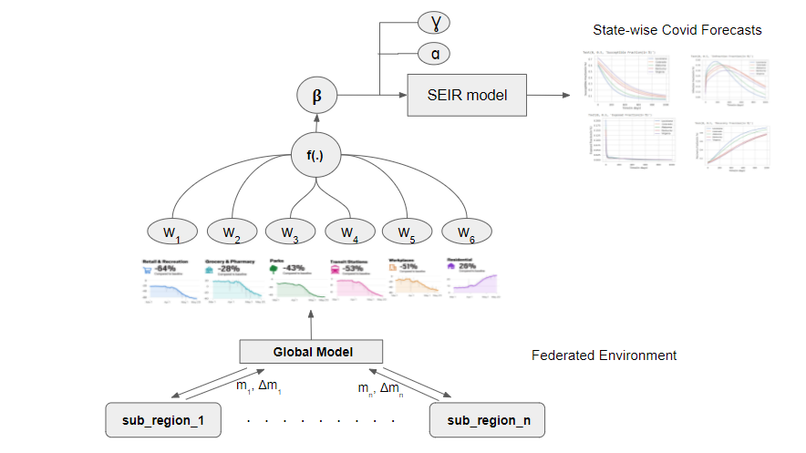

## Data
- Population estimates of states in US can be found [here](https://www.census.gov/programs-surveys/popest/technical-documentation/research/evaluation-estimates/2020-evaluation-estimates/2010s-totals-national.html)
- Mobility Data can be found [here](https://www.google.com/covid19/mobility/index.html?hl=en)
- State-wise covid estimates can be found [here](https://github.com/nytimes/covid-19-data)
- Bed availabilty can be found [here](https://healthdata.gov/browse?q=bed)

## Run the experiment
All the files can be run from your google drive in collab
To instantly check the results, use the datasets under the data folder and start following from point 4. below

1. **processingData.ipynb**
   - Combine mobility and covid cases data.
   - Convert cumulative cases to day-wise case count.
   - The processed file "US-state-processed-data.csv" is stored under the data folder. 

2. **createTrainingData.ipynb**
    - constructs training data for the fmtl model to get the weight vectors
    - We use Matlab to run the fmtl model and to train the model. 
    - This code converts the processed data to a .mat file, which becomes the training data.
    - Furthermore, we try to make the data homogeneous.
    - We get the train and test data from here.

3. **training model in Matlab environment** 
    - To train the model and get the weight vector, we use code from the [repo](https://github.com/gingsmith/fmtl)
    - This repo is the implementation of the paper [FMTL](https://arxiv.org/abs/1705.10467)
    - be sure to  
      - store the .mat file under the data folder in this fmtl  repo
      - change the data load info under both "model driver" and "optimization drive" code in the given fmtl code 
      - fix opts.obj='R'; % Regression

    - train the model and get weight vector 

4. **prediction.ipyb**
    - Utilizing the above weight vector, we can compare the actual test data with our forecasting. 

5. **baselines.ipynb**
    - To compare the prediction power of this fmtl model, we have compared it with four other models namely, RNN, linear regression, decision tree, and random forest.
    - Finally, we compared the error metrics between them.

6. **EpidemicModelSimulations.ipynb**
    - We also simulated the covid scenario using the SEIR model. 
    - Also, we found the threshold for infection spread above, which states medicare facilities will face bed shortage.

## Results
### State-wise Infection forecasts

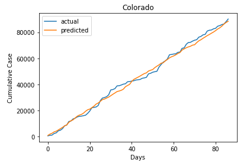  |  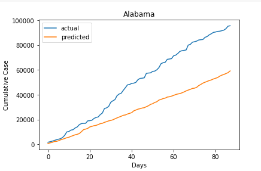 
:-------------------------:|:-------------------------:
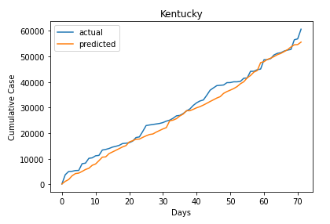  |  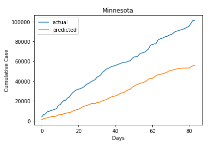

### SEIR simulation results

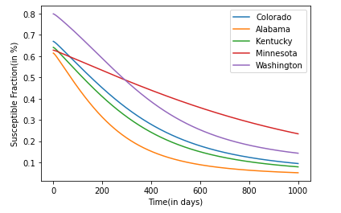  |  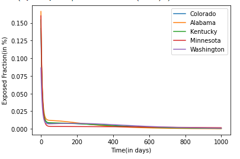 
:-------------------------:|:-------------------------:
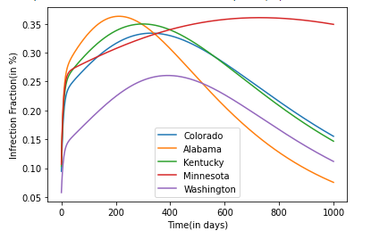  |  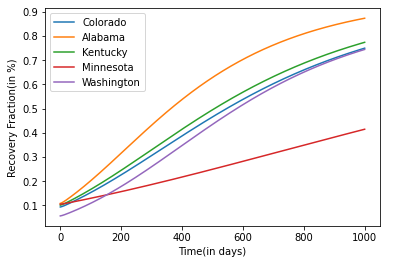

### Bed Availablity constraint for Louisiana

  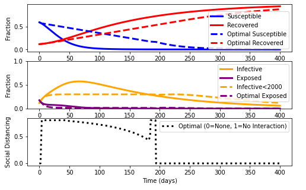

### Baseline Comparisons

  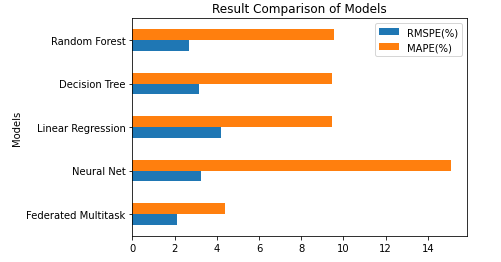

